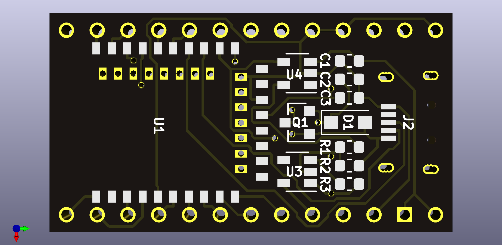
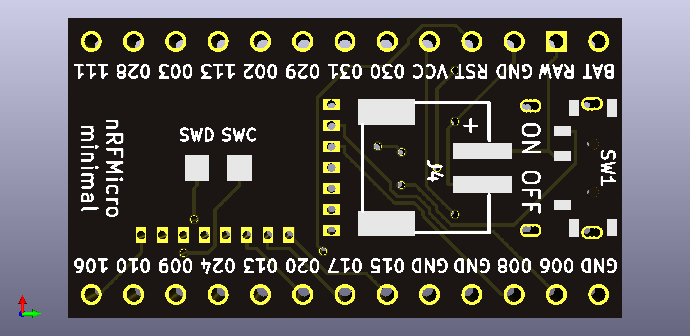

# nrfmicro

local fork to split out the usb pads

have included the jlcpcb bom, cfpl file in 'hardware/things'

instructions on how to generate the files from kicad 

https://support.jlcpcb.com/article/44-how-to-export-kicad-pcb-to-gerber-files

Arduino Pro Micro-sized breakout board for E73-2G4M08S1C (nRF52840) modules

## Downloads

Production-ready Gerber files and schematics are in the [releases section](https://github.com/joric/nrfmicro/releases).

## Development status

See project wiki:

* https://github.com/joric/nrfmicro/wiki

## Pictures

## References

* https://github.com/sekigon-gonnoc/BLE-Micro-Pro
* https://github.com/sekigon-gonnoc/qmk_firmware/tree/nrf52

